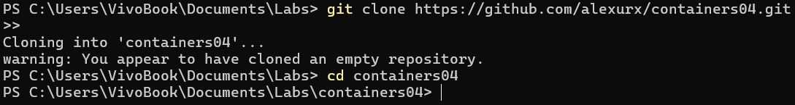
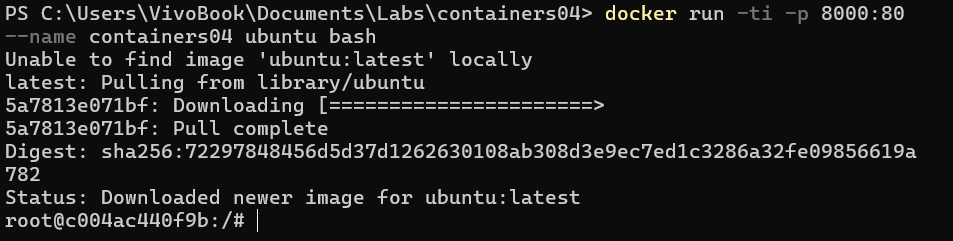
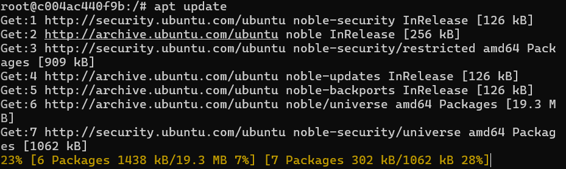
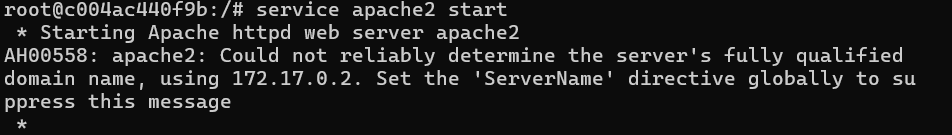
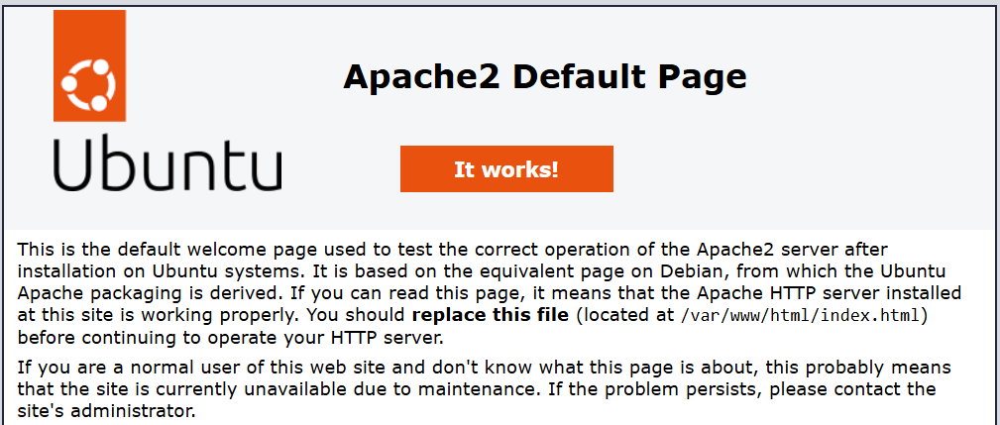
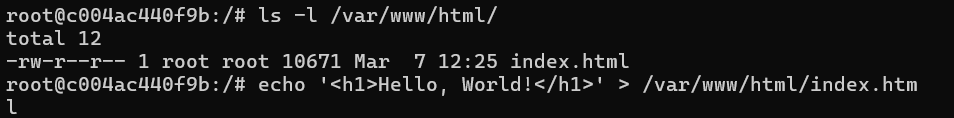
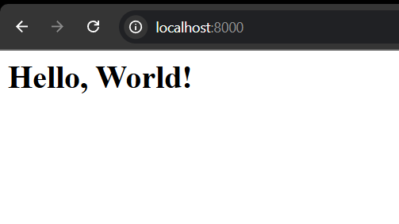
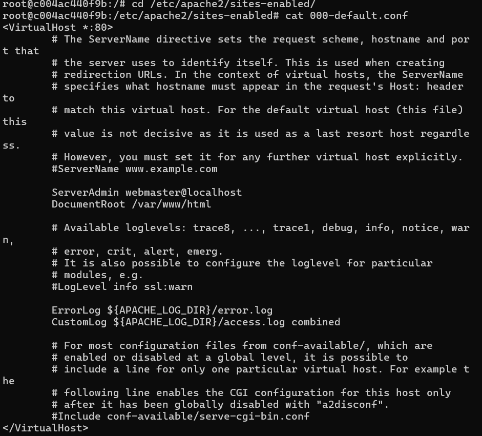
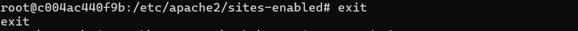
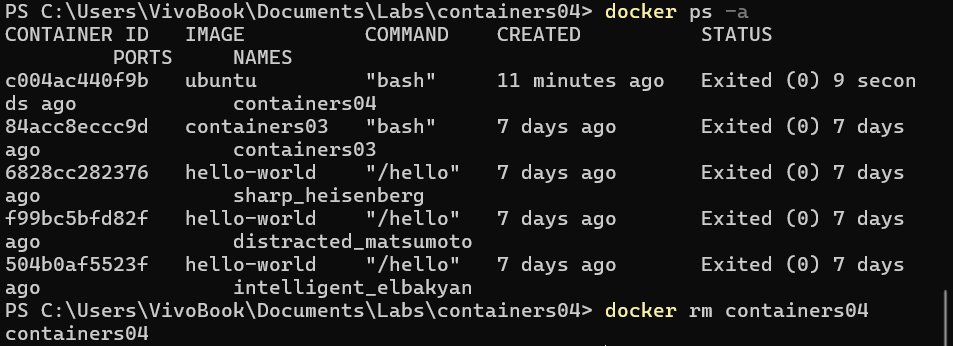

# Лабораторной работе IWNO4: Использование контейнеров как среды выполнения

## Цель работы

Я выполнил эту лабораторную работу, чтобы освежить в памяти основные команды ОС Debian/Ubuntu, познакомиться с Docker и его основными командами, а также научиться развертывать Web-сервер Apache в контейнере и обслуживать статические страницы.

## Задание

Мне необходимо было запустить контейнер Ubuntu, установить Web-сервер Apache и вывести в браузере страницу с текстом "Hello, World!".

## Подготовка

Я создал новый репозиторий на GitHub `containers04` и клонировал его себе:


## Выполнение работы

### Запуск контейнера

Я запустил контейнер с Ubuntu и открыл в нем Bash:



### Установка и запуск Apache

Я обновил список пакетов и установил Apache:

```sh
apt update
apt install apache2 -y
```


Затем запустил сервер Apache:

```sh
service apache2 start
```



### Проверка работы сервера

Я открыл браузер и перешел по адресу `http://localhost:8000`. На экране отобразилась стандартная страница Apache.


### Размещение страницы "Hello, World!"

Я проверил содержимое веб-директории cоздал файл `index.html` с текстом:


Обновил страницу в браузере, теперь отображался мой текст:


### Анализ конфигурации Apache

Я просмотрел настройки виртуального хоста Apache:



### Остановка и удаление контейнера

Я вышел из контейнера:

Затем посмотрел список контейнеров и удалил контейнер:



## Выводы

В результате выполнения работы я:

- Освоил основные команды Docker.
- Развернул контейнер с Ubuntu.
- Установил и настроил Apache внутри контейнера.
- Создал и отобразил веб-страницу "Hello, World!".
- Проанализировал настройки Apache.
- Научился управлять контейнерами, включая их удаление.

## Завершение

Я закоммитил изменения и отправил их в репозиторий:

```sh
git add .
git commit -m "IWNO4"
git push origin main
```

**Ссылка на репозиторий:** [GitHub](https://github.com/alexurx/containers04)